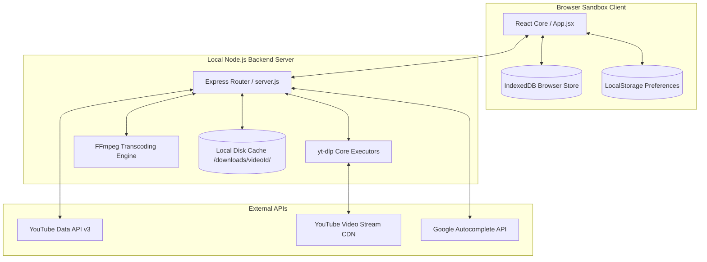
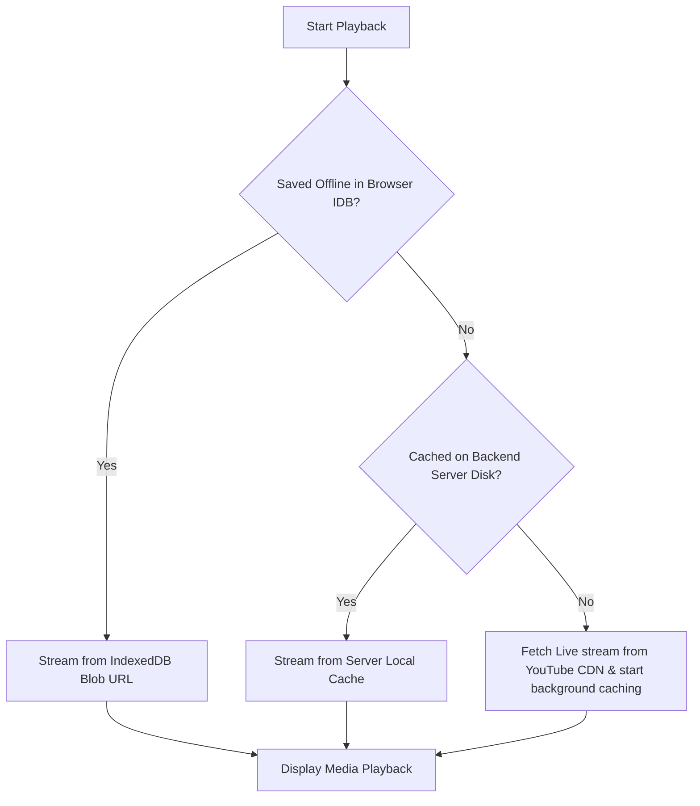
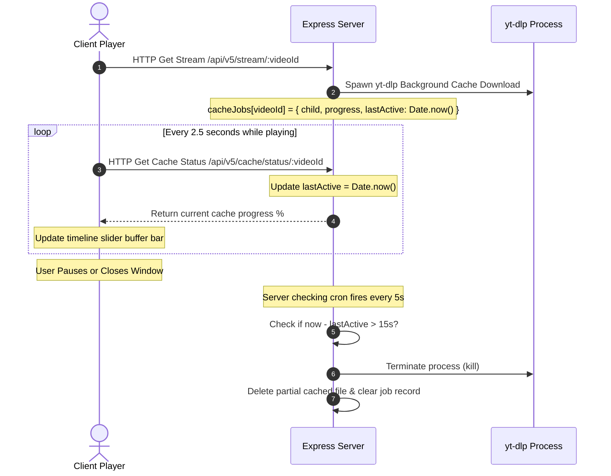

# TubeHub - System Design & Architecture

This document describes the architectural principles, component structure, media flow, and data management mechanisms implemented in TubeHub.

---

## 1. Core Project Goals

TubeHub is designed as a privacy-respecting, data-efficient media player and browser-based offline media vault.

1. **Privacy-First Operations**
   - Direct clients are decoupled from YouTube's tracking infrastructure. All requests for streams, search autocomplete, and metadata are proxied through the local Node.js server.
   - Client searches, API keys, and histories are saved client-side or filtered/cleaned on the local proxy.
2. **Bandwidth Minimization (Data Reduction)**
   - Media files, metadata, and thumbnail images are aggressively cached on the local backend server disk and client browser's IndexedDB.
   - Re-streaming previously played content uses 100% local resources.
3. **Adaptive Cache Control**
   - Background downloads for playing media are throttled and stopped when the user is inactive (e.g. paused or navigated away), preventing the wasteful download of full videos.
4. **Fully Offline Vault**
   - High-quality audio (MP3) or video (MP4) files can be cloned directly into the browser's persistent sandbox database (IndexedDB) for offline playback when disconnected from the backend.

---

## 2. System Overview & Components

The application is structured into three primary tiers:

---

## 3. Media Flow Hierarchy

When a user requests to play a video, TubeHub routes media through a fallback chain to minimize network overhead:

### Media Flow Resolution Details:
1. **Local Browser Store (IndexedDB)**
   - If the active video exists in the browser's database, the player converts the stored Blob into a local URL object (`URL.createObjectURL(blob)`). Playback occurs entirely client-side.
2. **Backend Cache (`downloads/${videoId}/cache_${quality}.${ext}`)**
   - If not found in IndexedDB, the player requests the backend stream route (`/api/v5/stream/:videoId`).
   - If the server has completed caching the exact quality format to disk, it responds directly with the cached file.
   - **Smart Cache Precedence**: If a higher or equal quality cached video is available on the backend server, the streaming proxy will play it directly when a user streams a lower resolution, bypassing remote network hits.
   - For audio-only streams (`ext=mp3`), the backend automatically selects the highest quality video cached on disk for that ID and transcodes it on-the-fly to MP3 using FFmpeg, rather than streaming from YouTube.
3. **YouTube Direct Fetch & Background Cache**
   - If the media is uncached (or if only a lower quality is cached than requested), the backend extracts the direct stream URL from YouTube and proxies it to the client via HTTPS Range Requests.
   - Concurrently, it kicks off a background download process to build the backend cache for subsequent plays.
4. **Format-Switch & Playback State Preservation**
   - When switching format options (or when caching completes), a cache-busting timestamp (`_t=timestamp`) is appended to the stream URL state, forcing the browser to discard its cached connection/partial buffers.
   - Playback time positions (via checking `readyState >= 1` during time updates to prevent zero-value resets) and play/pause states are recorded and restored seamlessly across reloads.

---

## 4. Adaptive Cache Control (Heartbeat Mechanism)

To ensure the backend doesn't waste bandwidth downloading videos that are paused or abandoned:

### Key Parameters:
- **Status/Heartbeat Rate**: 2.5 seconds.
- **Inactivity Threshold**: 15 seconds.
- **Cleanup Interval**: 5 seconds.

---

## 5. Storage & Cache Management

To allow users to audit and manage disk space consumption:

### 1. Server-Side Cache Manager
- **Subdirectory Organization**: Files are nested inside video ID subfolders (`downloads/${videoId}/`) to keep the root cache clean. Thumbnails are named `thumbnail.jpg`, cache files are named `cache_${quality}.${ext}`, and conversion files are named `${jobId}.${ext}`.
- **Audit**: Client requests `GET /api/v5/cache/size`. The server recursively walks all subdirectories of `downloads/`, sums their bytes, and returns the total bytes and file counts.
- **Purge**: Client requests `DELETE /api/v5/cache`. The server recursively sweeps all files and folders in `downloads/` except `cookies.txt` and files matching absolute paths of active downloading `cacheJobs` (e.g. unfinished downloads). Empty video ID folders are automatically cleaned up.
- **Stateless Caching Preference Control**: By default, backend disk caching is disabled for new plays. Users can toggle this setting in the client UI. The toggle state is saved locally in the browser's `localStorage` and passed as a query parameter (`&cache=true` or `&cache=false`) in individual stream requests. The server processes this parameter statelessly on each stream query, allowing each user to control server-side caching independently without modifying global server configurations or impacting other client instances.

### 2. Browser-Side Offline Library
- **Audit**: Client calls `getMediaSizeEstimate()` which opens an IndexedDB cursor to iterate over all entries in `media_store`, summing their sizes. Keys ending with `-thumbnail` are included in the size but excluded from the unique item count.
- **Clear**: Client calls `clearAllStorage()` which initiates a `clear()` request on the IndexedDB media store.
