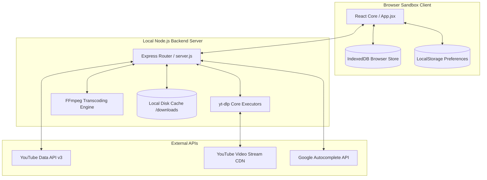
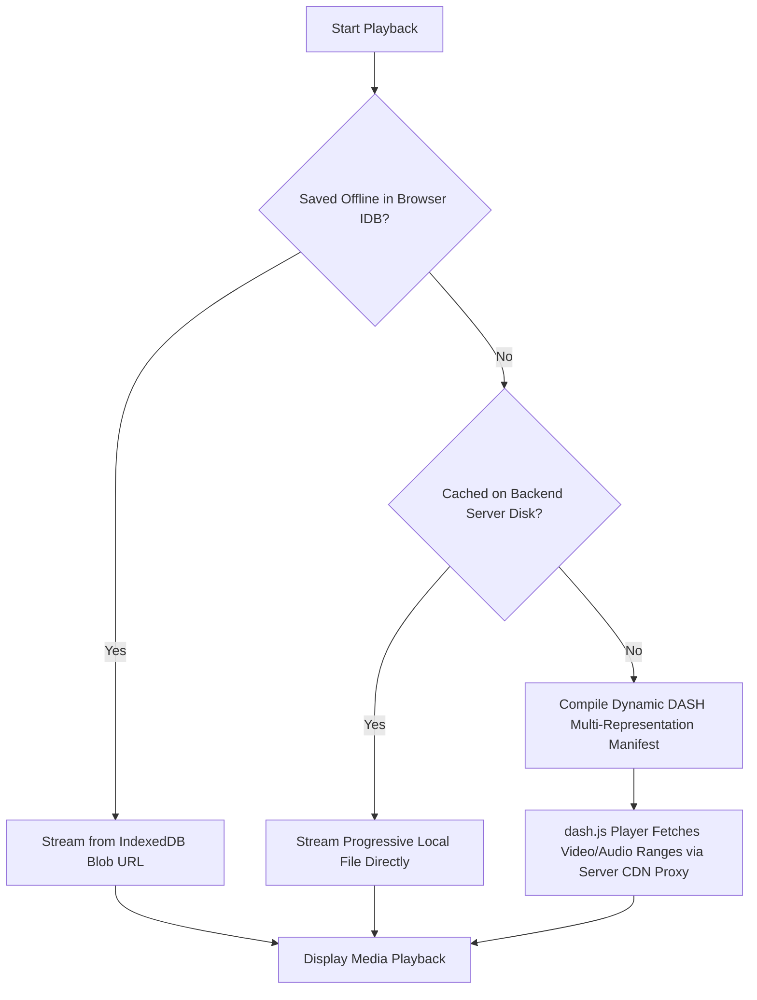
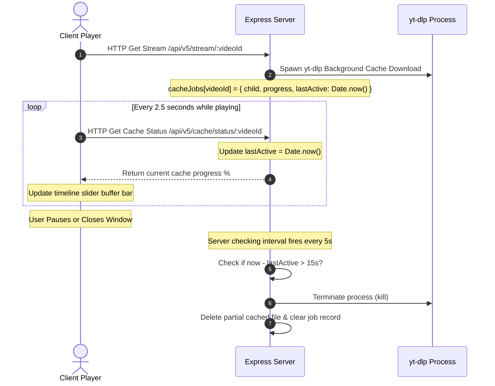

# TubeHub - High-Level Design (HLD)

This document describes the high-level system architecture, component dependencies, media fallback routing logic, and backend API contracts of TubeHub.

---

## 1. System Architecture & Components

TubeHub consists of three primary tiers:



### Component Details:
* **React Client**: Renders the dark glassmorphic interface, handles media player controls, updates SEO tags dynamically, manages search suggestions, and interacts with local storage.
* **Express Backend**: Proxies range requests, manages cache downloader processes, transcodes media on-the-fly, serves cached files, and audits disk consumption.
* **yt-dlp Core**: Spawns CLI jobs to extract direct media streams and download cache files.
* **FFmpeg Engine**: Concurrently transcodes cached media into targeted formats (e.g. converting MP4 video to MP3 audio).

---

## 2. Playback Fallback Routing

To minimize server load and internet bandwidth consumption, the streaming route resolves media requests in a strict precedence chain:



### Precedence Details:
1. **IndexedDB (Offline Store)**: Checked first. If a blob exists matching the requested format/quality, it is played fully client-side using a Blob URL.
2. **Exact Local Cache (Server Progressive Stream)**: If the exact quality file (e.g. 720p MP4 or 256kbps MP3) exists in the server cache (`downloads/cache/`), the player bypasses the manifest and loads the file directly via progressive streaming.
3. **Smart Cached Precedence**:
   * If a **higher or equal quality** video (MP4) is cached, the server plays it directly for the user's lower-quality play request, saving network resources.
   * If an MP3 is requested and *any* video is cached, the server transcodes the highest quality cached video available on disk on-the-fly and pipes it to the user.
4. **Adaptive DASH Manifest (Uncached Streams)**: If uncached, the server compiles a dynamic multi-representation manifest (`manifest.mpd`). The client `dash.js` instance streams the video smoothly across qualities by requesting individual byte chunks through the server's HTTPS range-proxy endpoint. Under the hood, a background downloader warms the cache for the selected representation.

---

## 3. Adaptive Caching heartbeats

To prevent full downloads when a user pauses or abandons a video, background caching is managed via a keep-alive heartbeat loop:



---

## 4. Primary Backend API Contracts

### 1. `GET /api/v5/info/:videoId`
* **Purpose**: Fetches video metadata, thumbnails, and lists of formats, adding cached flags.
* **Response**:
  ```json
  {
    "videoId": "2vYyHb34upc",
    "title": "Video Title",
    "duration": 284,
    "isCached": true,
    "formats": {
      "audio": [{ "token": "audio-320-...", "quality": 320, "ext": "mp3", "isCached": false }],
      "video": [{ "token": "video-2160-...", "quality": 2160, "ext": "mp4", "isCached": true }]
    }
  }
  ```

### 2. `GET /api/v5/stream/:videoId/manifest.mpd`
* **Purpose**: Compiles and returns a dynamic, aspect-ratio-aware DASH manifest XML file for adaptive playback.
* **Query Parameters**:
  * `cache`: `true` or `false` (default `false`, spins up a background caching thread for the initial selected resolution)
  * `ttl`: Cache duration in seconds (optional)
* **Response**: XML content (`Content-Type: application/dash+xml`) containing representations for all standard qualities up to 8K (`4320`, `2160`, `1440`, `1080`, `720`, `480`, `360`). If target quality is > 1080p, representations are compiled using the `av01` (AV1) codec, otherwise standard `avc1` (H.264) is returned.

### 3. `GET /api/v5/stream/:videoId`
* **Purpose**: Streams cached MP4/MP3 files directly or plays transcoded audio on-the-fly.
* **Query Parameters**:
  * `ext`: `mp3` or `mp4` (default `mp4`)
  * `quality`: target resolution/bitrate (e.g. `720`, `128`)
  * `cache`: `true` or `false` (enables server-side caching job)

### 4. `GET /api/v5/cache/status/:videoId`
* **Purpose**: Returns progress for the active cache job. Serves as a keep-alive heartbeat.
* **Response**:
  ```json
  {
    "videoId": "2vYyHb34upc",
    "isCached": false,
    "progress": 45
  }
  ```

### 5. `POST /api/v5/convert`
* **Purpose**: Starts a background conversion job for downloading or browser offline saving.
* **Payload**: `{ "token": "video-720-2vYyHb34upc" }`
* **Response**: `{ "success": true, "jobId": "xyz123" }`
